# #SriLanka 🇱🇰 - Flood Map

Infographics, Charts and Data of **River Water Levels** across Sri Lanka.

[Data](data) from the [Disaster Management Center](https://www.dmc.gov.lk) of Sri Lanka.

Updated whenever new information is released by the DMC, usually every **3 hours**.

High-Resolution Map Image: [https://nuuuwan.github.io/lk_dmc_vis](https://nuuuwan.github.io/lk_dmc_vis)

Detailed Analysis and Projections: [https://github.com/nuuuwan/lk_dmc_vis/blob/main/README.md](https://github.com/nuuuwan/lk_dmc_vis/blob/main/README.md)

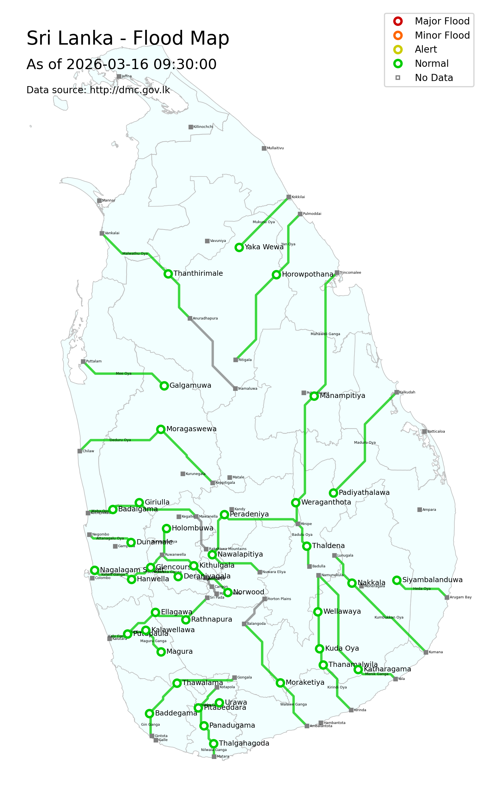

## 🚨 IMPORTANT: Higher Frequency River Water Level Data 🆕

The **Irrigation Department**’s Hydrology and Disaster
Management Division measures and publishes river
water levels **several times per hour**.

The **Disaster Management Centre (DMC)** obtains these
same measurements from the Irrigation Department,
then issues an *aggregated bulletin* approximately
every **three hours**.

And so, if you are analysing river water levels or building
flood-related tools, the Irrigation Department’s
**higher resolution** dataset is the better choice.

I am collecting the Irrigation Department data here:
[https://github.com/nuuuwan/lk_irrigation](https://github.com/nuuuwan/lk_irrigation)

I will continue to maintain 
[https://github.com/nuuuwan/lk_dmc_vis](https://github.com/nuuuwan/lk_dmc_vis),
which is based off DMC's bulletins,
since some of you are using it.

## Summary Table

| Gauging Station | River | River Basin | Level (m) | Rate-of-Rise (m/hr) | Alert |
|-----------------|-------|-------------|----------:|--------------------:|-------|
| [Yaka Wewa](https://www.google.com/maps/place/8.726531670464757,80.67505377972024) | Mukunu Oya | Maa Oya | 1.9 | 🔺0.11 | 🟢 Normal |
| [Thanthirimale](https://www.google.com/maps/place/8.580763249784683,80.28400551575419) | Malwathu Oya | Malwathu Oya | 4.0 | 🔺0.04 | 🟢 Normal |
| [Kithulgala](https://www.google.com/maps/place/6.985283769517581,80.42544930669654) | Kelani Ganga | Kelani Ganga | 1.8 | 🔺0.03 | 🟢 Normal |
| [Putupaula](https://www.google.com/maps/place/6.611561688998894,80.05974948036196) | Kalu Ganga | Kalu Ganga | 0.7 | 🔺0.03 | 🟢 Normal |
| [Moragaswewa](https://www.google.com/maps/place/7.731867586461941,80.24296279159842) | Deduru Oya | Deduru Oya | 1.5 | 🔺0.03 | 🟢 Normal |
| [Nagalagam Street](https://www.google.com/maps/place/6.96027242132317,79.87858326530204) | Kelani Ganga | Kelani Ganga | 0.6 | 🔺0.03 | 🟢 Normal |
| [Thalgahagoda](https://www.google.com/maps/place/6.012329836481981,80.5347970941782) | Nilwala Ganga | Nilwala Ganga | 0.5 | 🔺0.02 | 🟢 Normal |
| [Baddegama](https://www.google.com/maps/place/6.177477311875031,80.18051836126706) | Gin Ganga | Gin Ganga | 1.1 | 🔺0.01 | 🟢 Normal |
| [Thaldena](https://www.google.com/maps/place/7.092702894310825,81.04865409851845) | Badulu Oya | Mahaweli Ganga | 0.8 | 🔺0.01 | 🟢 Normal |
| [Manampitiya](https://www.google.com/maps/place/7.913305747028369,81.08904162459265) | Mahaweli Ganga | Mahaweli Ganga | 2.1 | 🔺0.01 | 🟢 Normal |
| [Siyambalanduwa](https://www.google.com/maps/place/6.905508688496518,81.54537666124355) | Heda Oya | Heda Oya | 0.9 | 0.01 | 🟢 Normal |
| [Nakkala](https://www.google.com/maps/place/6.890291115719028,81.29789316071579) | Kumbukkan Oya | Kumbukkan Oya | 1.1 | 0.01 | 🟢 Normal |
| [Galgamuwa](https://www.google.com/maps/place/7.968417972307392,80.26139261952191) | Mee Oya | Mee Oya | 0.6 | 0.01 | 🟢 Normal |
| [Rathnapura](https://www.google.com/maps/place/6.689859893761882,80.38027645749384) | Kalu Ganga | Kalu Ganga | 1.2 | 0.00 | 🟢 Normal |
| [Weraganthota](https://www.google.com/maps/place/7.329958849723429,80.98789578050872) | Mahaweli Ganga | Mahaweli Ganga | -1.5 | 0.00 | 🟢 Normal |
| [Nawalapitiya](https://www.google.com/maps/place/7.046038718801128,80.52624731051829) | Mahaweli Ganga | Mahaweli Ganga | 1.0 | 0.00 | 🟢 Normal |
| [Wellawaya](https://www.google.com/maps/place/6.733186416118142,81.10987205932976) | Kirindi Oya | Kirindi Oya | 0.9 | 0.00 | 🟢 Normal |
| [Glencourse](https://www.google.com/maps/place/6.975736673046383,80.18660711562987) | Kelani Ganga | Kelani Ganga | 9.3 | 0.00 | 🟢 Normal |
| [Holombuwa](https://www.google.com/maps/place/7.18861230041471,80.27381001159266) | Gurugoda Oya | Kelani Ganga | 0.6 | 0.00 | 🟢 Normal |
| [Urawa](https://www.google.com/maps/place/6.236507396306039,80.56633784106945) | Urubokka Ganga | Nilwala Ganga | 0.5 | 0.00 | 🟢 Normal |
| [Moraketiya](https://www.google.com/maps/place/6.3450504078771,80.90195373048093) | Walawe Ganga | Walawe Ganga | 1.0 | 0.00 | 🟢 Normal |
| [Kuda Oya](https://www.google.com/maps/place/6.531299778512797,81.11931312403397) | Kuda Oya | Kirindi Oya | 1.4 | 0.00 | 🟢 Normal |
| [Padiyathalawa](https://www.google.com/maps/place/7.3827145879708445,81.19476999029227) | Maduru Oya | Maduru Oya | 0.9 | 0.00 | 🟢 Normal |
| [Giriulla](https://www.google.com/maps/place/7.3303094121475345,80.12432086937476) | Maha Oya | Maha Oya | 1.1 | 0.00 | 🟢 Normal |
| [Dunamale](https://www.google.com/maps/place/7.113033305509533,80.07900097051707) | Attanagalu Oya | Attanagalu Oya | 1.2 | 0.00 | 🟢 Normal |
| [Norwood](https://www.google.com/maps/place/6.839557267884663,80.61239609102284) | Kehelgamu Oya | Kelani Ganga | 0.7 | -0.00 | 🟢 Normal |
| [Thawalama](https://www.google.com/maps/place/6.342938049010117,80.33185946143057) | Gin Ganga | Gin Ganga | 1.4 | -0.00 | 🟢 Normal |
| [Thanamalwila](https://www.google.com/maps/place/6.44280954004885,81.13889314602751) | Kirindi Oya | Kirindi Oya | 0.9 | -0.00 | 🟢 Normal |
| [Katharagama](https://www.google.com/maps/place/6.418350424146931,81.33162402101244) | Menik Ganga | Menik Ganga | 0.1 | -0.00 | 🟢 Normal |
| [Badalgama](https://www.google.com/maps/place/7.2931279607144255,79.97767925329397) | Maha Oya | Maha Oya | 2.3 | -0.00 | 🟢 Normal |
| [Pitabeddara](https://www.google.com/maps/place/6.20712968715078,80.45044348808202) | Nilwala Ganga | Nilwala Ganga | 0.7 | -0.00 | 🟢 Normal |
| [Magura](https://www.google.com/maps/place/6.513716270509724,80.24399187228877) | Maguru Ganga | Kalu Ganga | 1.4 | -0.01 | 🟢 Normal |
| [Ellagawa](https://www.google.com/maps/place/6.730399127799353,80.21307042256922) | Kalu Ganga | Kalu Ganga | 4.7 | -0.01 | 🟢 Normal |
| [Panadugama](https://www.google.com/maps/place/6.1100549018149115,80.48065133051018) | Nilwala Ganga | Nilwala Ganga | 2.7 | -0.01 | 🟢 Normal |
| [Kalawellawa](https://www.google.com/maps/place/6.6315078194386246,80.16073462916866) | Kuda Ganga | Kalu Ganga | 2.0 | -0.01 | 🟢 Normal |
| [Peradeniya](https://www.google.com/maps/place/7.2641705575045075,80.5936236622826) | Mahaweli Ganga | Mahaweli Ganga | 2.5 | -0.01 | 🟢 Normal |
| [Hanwella](https://www.google.com/maps/place/6.910489028063102,80.08133984391833) | Kelani Ganga | Kelani Ganga | 1.2 | -0.01 | 🟢 Normal |
| [Deraniyagala](https://www.google.com/maps/place/6.925762947059961,80.33922404112188) | Seethawaka Ganga | Kelani Ganga | 0.5 | -0.02 | 🟢 Normal |
| [Horowpothana](https://www.google.com/maps/place/8.577144224946247,80.88120305584708) | Yan Oya | Yan Oya | 5.8 | -0.03 | 🟢 Normal |

## Yan Oya River Basin (RB 67)

### Yan Oya

#### 🟢 Normal - [Horowpothana](https://www.google.com/maps/place/8.577144224946247,80.88120305584708) Gauging Station

*Last Updated **291 hours** ago* ⌛

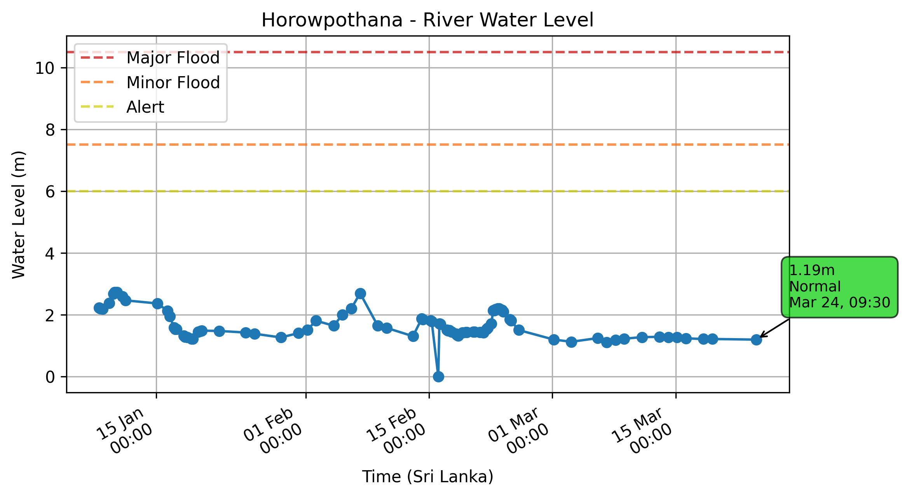

## Nilwala Ganga River Basin (RB 12)

### Urubokka Ganga

#### 🟢 Normal - [Urawa](https://www.google.com/maps/place/6.236507396306039,80.56633784106945) Gauging Station

*Last Updated **291 hours** ago* ⌛

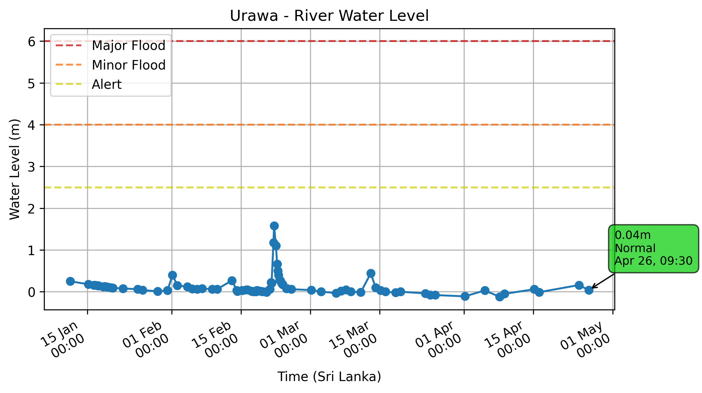

### Nilwala Ganga

#### 🟢 Normal - [Thalgahagoda](https://www.google.com/maps/place/6.012329836481981,80.5347970941782) Gauging Station

*Last Updated **291 hours** ago* ⌛

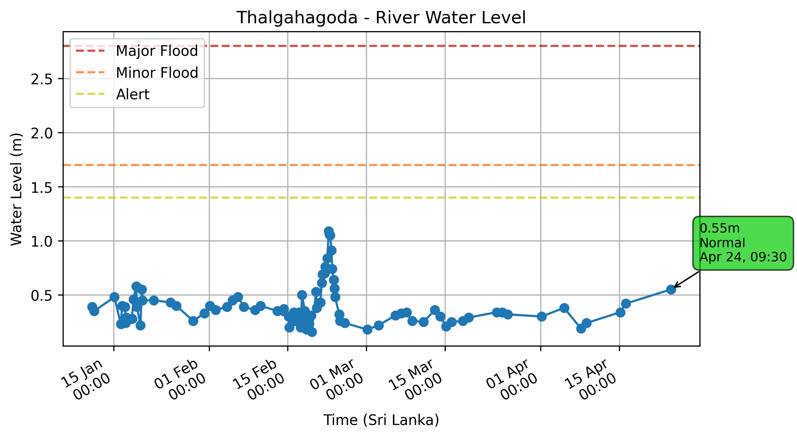

#### 🟢 Normal - [Panadugama](https://www.google.com/maps/place/6.1100549018149115,80.48065133051018) Gauging Station

*Last Updated **291 hours** ago* ⌛

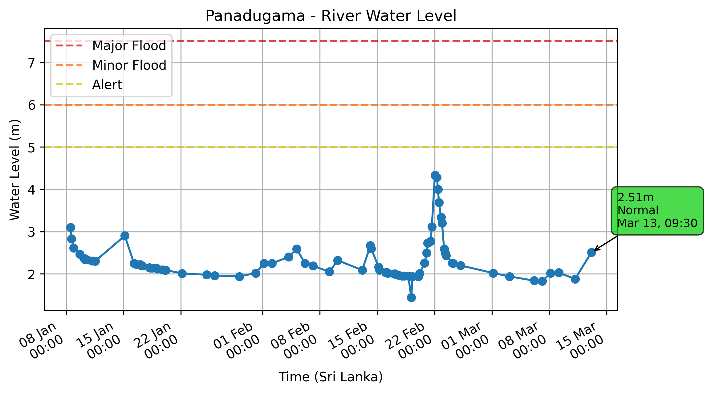

#### 🟢 Normal - [Pitabeddara](https://www.google.com/maps/place/6.20712968715078,80.45044348808202) Gauging Station

*Last Updated **291 hours** ago* ⌛

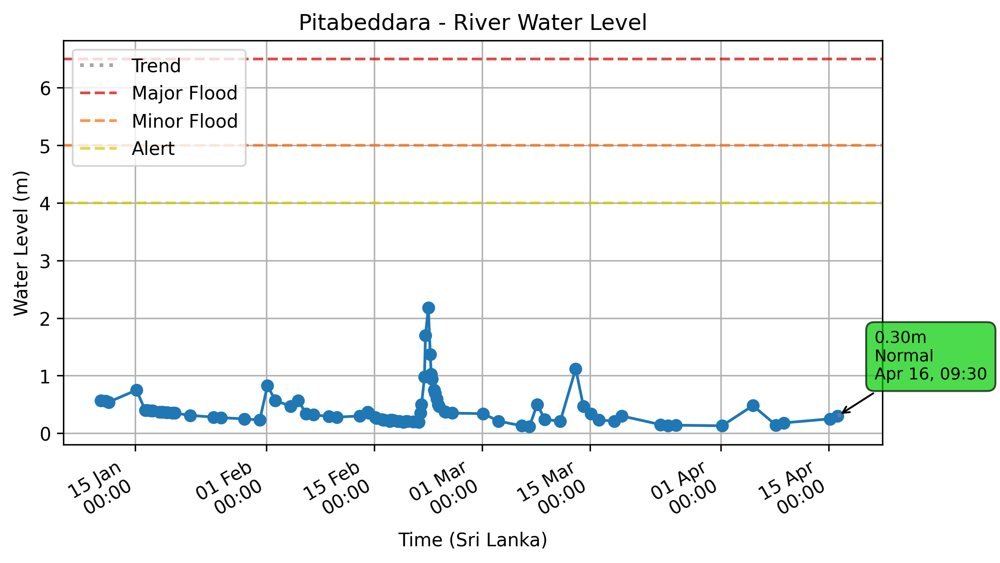

## Walawe Ganga River Basin (RB 18)

### Walawe Ganga

#### 🟢 Normal - [Moraketiya](https://www.google.com/maps/place/6.3450504078771,80.90195373048093) Gauging Station

*Last Updated **291 hours** ago* ⌛

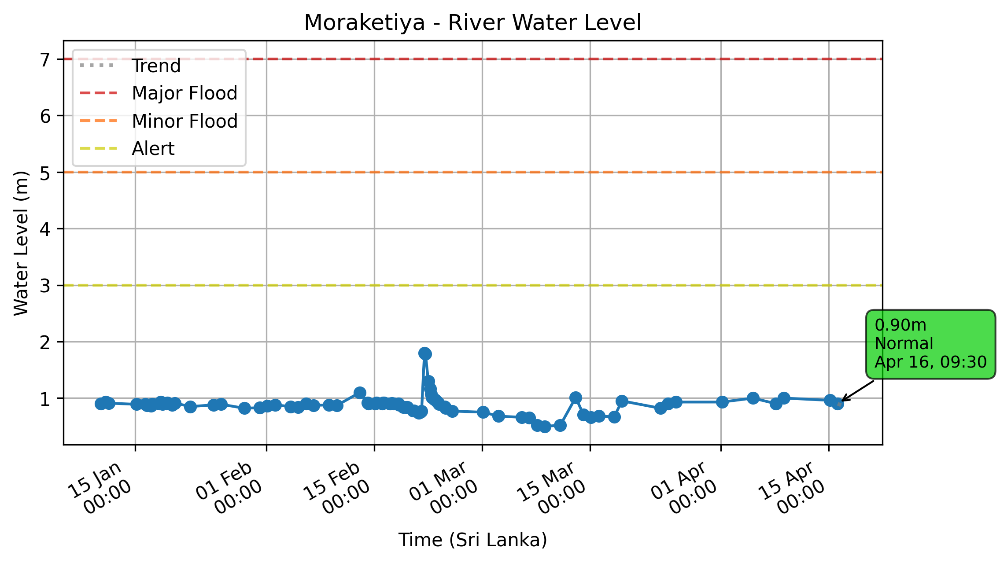

## Menik Ganga River Basin (RB 26)

### Menik Ganga

#### 🟢 Normal - [Katharagama](https://www.google.com/maps/place/6.418350424146931,81.33162402101244) Gauging Station

*Last Updated **291 hours** ago* ⌛

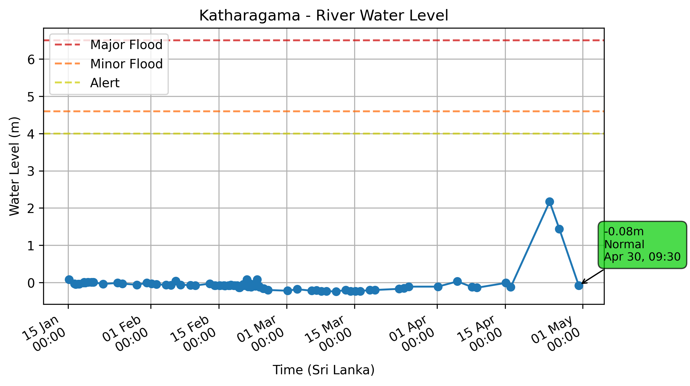

## Maduru Oya River Basin (RB 54)

### Maduru Oya

#### 🟢 Normal - [Padiyathalawa](https://www.google.com/maps/place/7.3827145879708445,81.19476999029227) Gauging Station

*Last Updated **291 hours** ago* ⌛

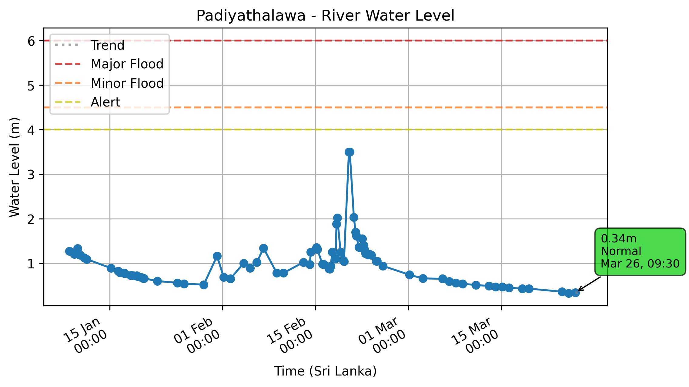

## Mee Oya River Basin (RB 95)

### Mee Oya

#### 🟢 Normal - [Galgamuwa](https://www.google.com/maps/place/7.968417972307392,80.26139261952191) Gauging Station

*Last Updated **291 hours** ago* ⌛

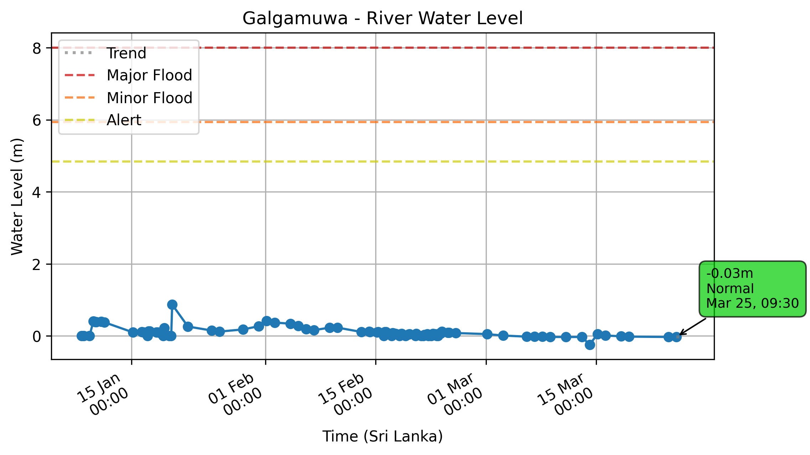

## Malwathu Oya River Basin (RB 90)

### Malwathu Oya

#### 🟢 Normal - [Thanthirimale](https://www.google.com/maps/place/8.580763249784683,80.28400551575419) Gauging Station

*Last Updated **291 hours** ago* ⌛

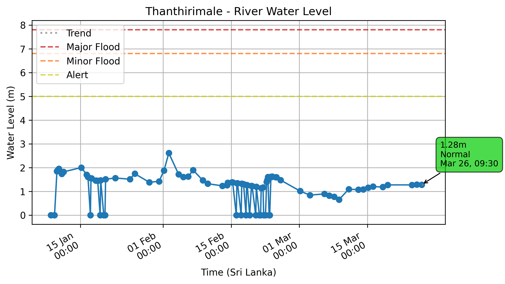

## Attanagalu Oya River Basin (RB 103)

### Attanagalu Oya

#### 🟢 Normal - [Dunamale](https://www.google.com/maps/place/7.113033305509533,80.07900097051707) Gauging Station

*Last Updated **291 hours** ago* ⌛

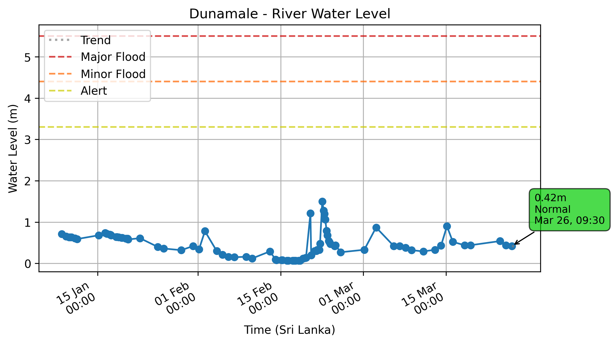

## Gin Ganga River Basin (RB 09)

### Gin Ganga

#### 🟢 Normal - [Baddegama](https://www.google.com/maps/place/6.177477311875031,80.18051836126706) Gauging Station

*Last Updated **291 hours** ago* ⌛

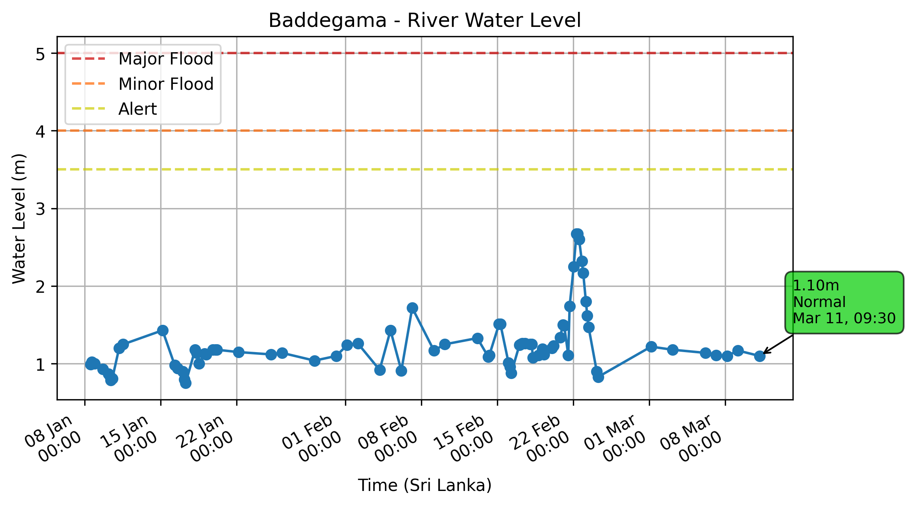

#### 🟢 Normal - [Thawalama](https://www.google.com/maps/place/6.342938049010117,80.33185946143057) Gauging Station

*Last Updated **291 hours** ago* ⌛

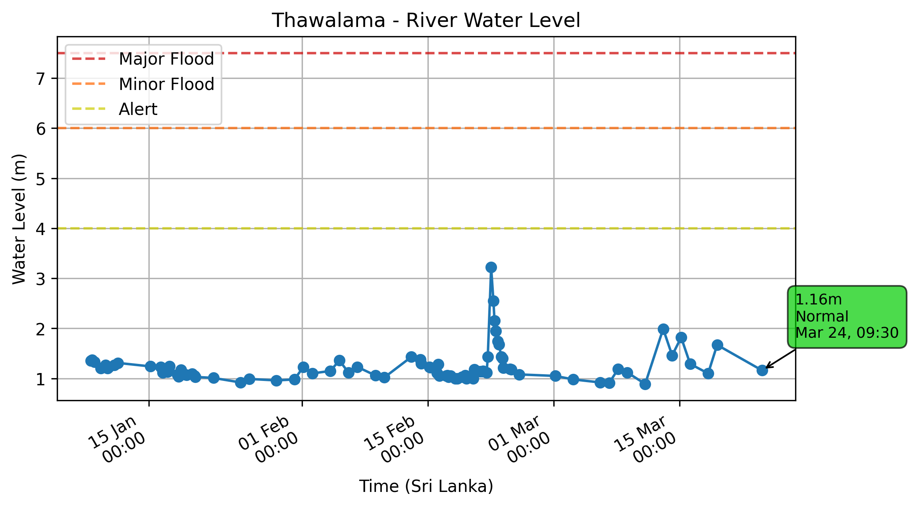

## Mahaweli Ganga River Basin (RB 60)

### Mahaweli Ganga

#### 🟢 Normal - [Manampitiya](https://www.google.com/maps/place/7.913305747028369,81.08904162459265) Gauging Station

*Last Updated **291 hours** ago* ⌛

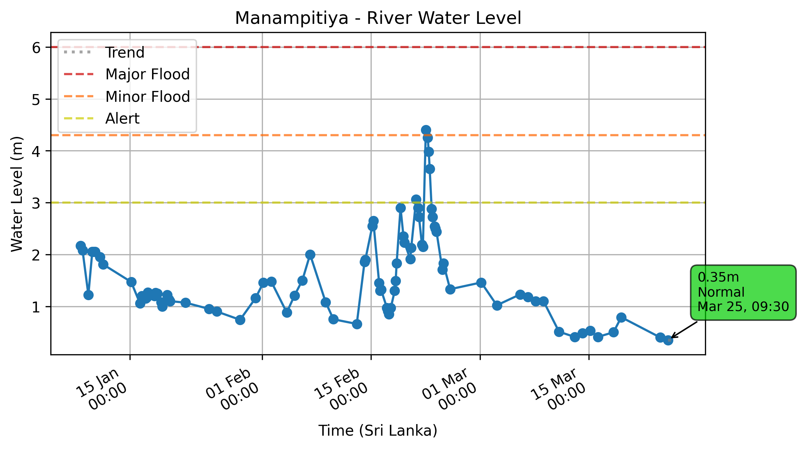

#### 🟢 Normal - [Peradeniya](https://www.google.com/maps/place/7.2641705575045075,80.5936236622826) Gauging Station

*Last Updated **291 hours** ago* ⌛

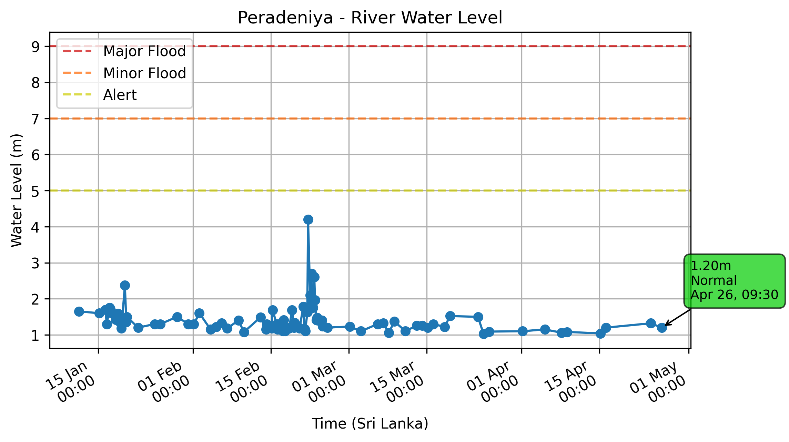

#### 🟢 Normal - [Weraganthota](https://www.google.com/maps/place/7.329958849723429,80.98789578050872) Gauging Station

*Last Updated **291 hours** ago* ⌛

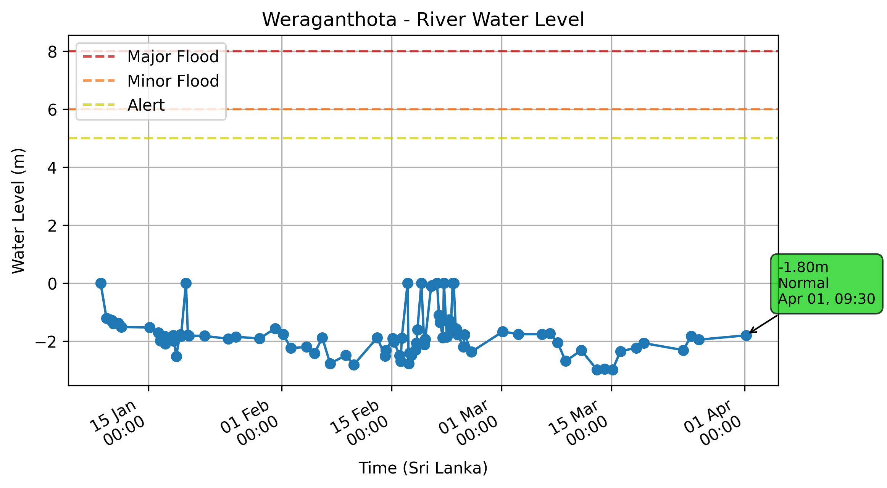

#### 🟢 Normal - [Nawalapitiya](https://www.google.com/maps/place/7.046038718801128,80.52624731051829) Gauging Station

*Last Updated **291 hours** ago* ⌛

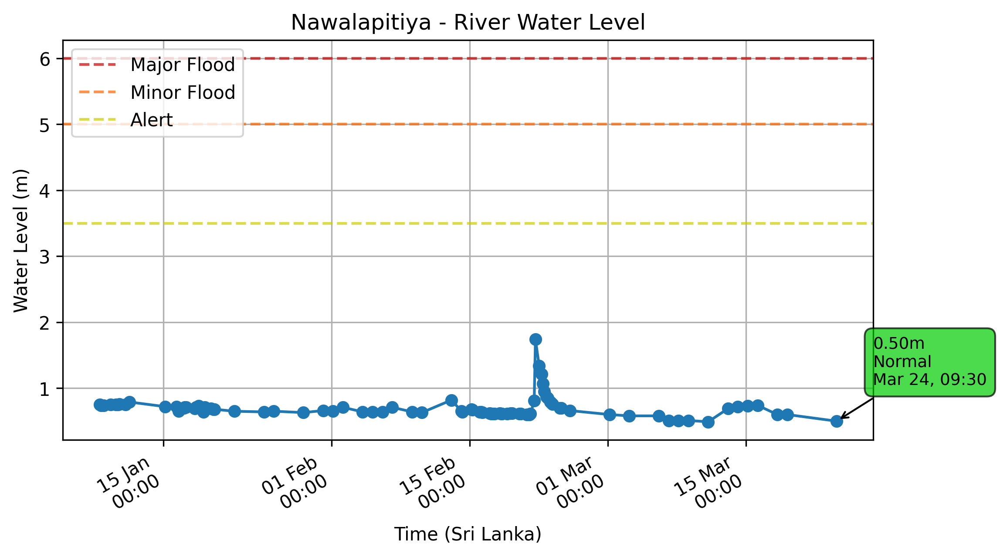

### Badulu Oya

#### 🟢 Normal - [Thaldena](https://www.google.com/maps/place/7.092702894310825,81.04865409851845) Gauging Station

*Last Updated **291 hours** ago* ⌛

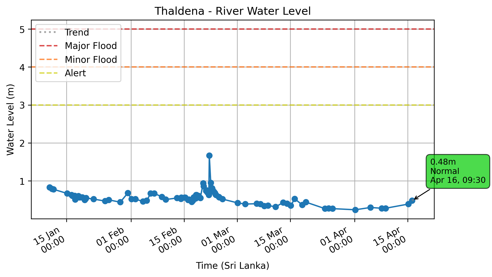

## Maa Oya River Basin (RB 69)

### Mukunu Oya

#### 🟢 Normal - [Yaka Wewa](https://www.google.com/maps/place/8.726531670464757,80.67505377972024) Gauging Station

*Last Updated **291 hours** ago* ⌛

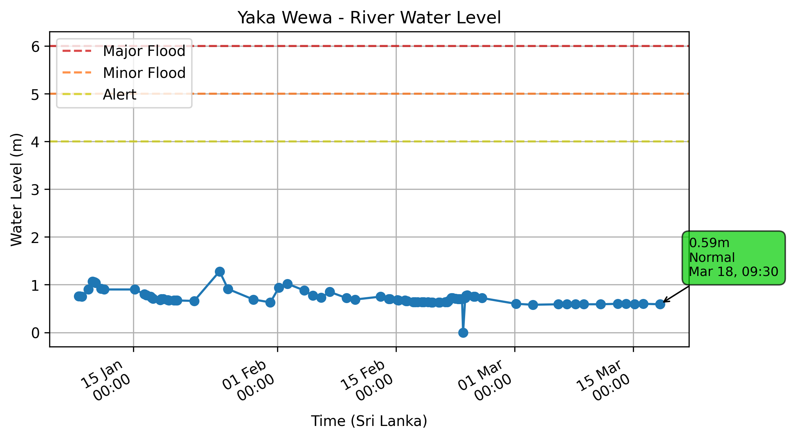

## Kalu Ganga River Basin (RB 03)

### Kuda Ganga

#### 🟢 Normal - [Kalawellawa](https://www.google.com/maps/place/6.6315078194386246,80.16073462916866) Gauging Station

*Last Updated **291 hours** ago* ⌛

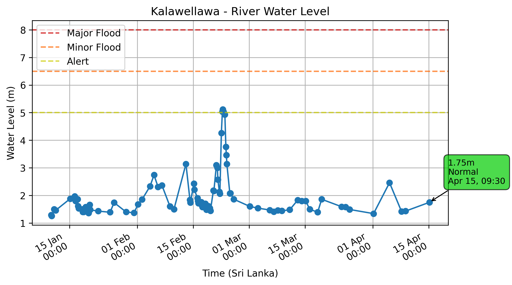

### Maguru Ganga

#### 🟢 Normal - [Magura](https://www.google.com/maps/place/6.513716270509724,80.24399187228877) Gauging Station

*Last Updated **291 hours** ago* ⌛

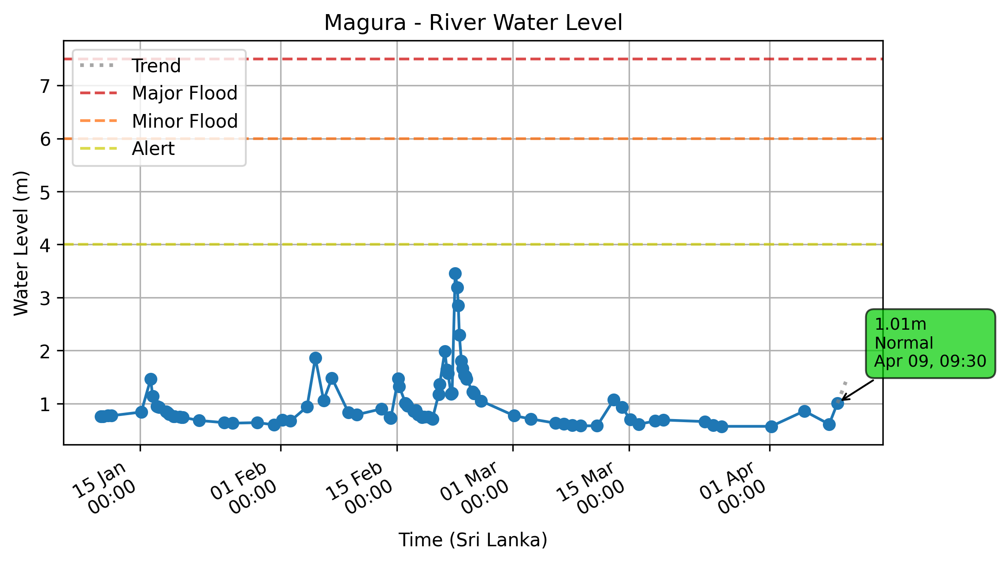

### Kalu Ganga

#### 🟢 Normal - [Rathnapura](https://www.google.com/maps/place/6.689859893761882,80.38027645749384) Gauging Station

*Last Updated **291 hours** ago* ⌛

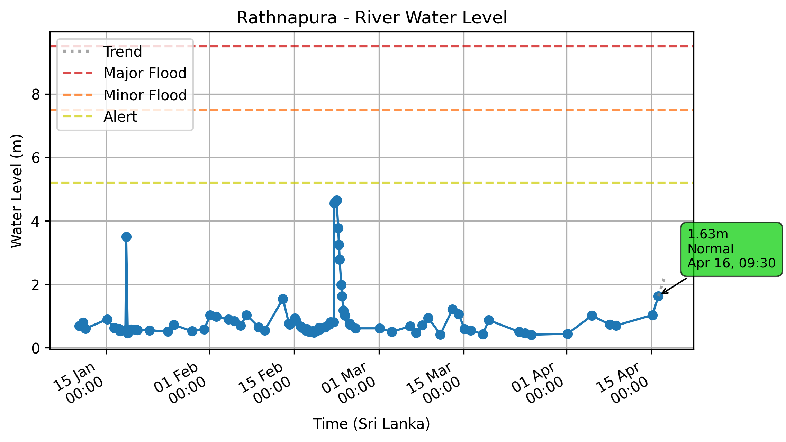

#### 🟢 Normal - [Putupaula](https://www.google.com/maps/place/6.611561688998894,80.05974948036196) Gauging Station

*Last Updated **291 hours** ago* ⌛

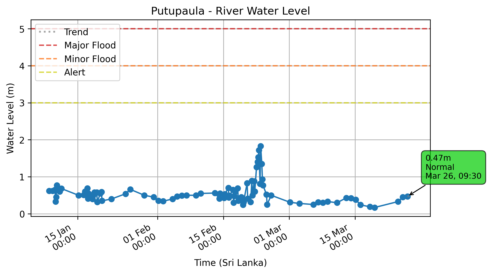

#### 🟢 Normal - [Ellagawa](https://www.google.com/maps/place/6.730399127799353,80.21307042256922) Gauging Station

*Last Updated **291 hours** ago* ⌛

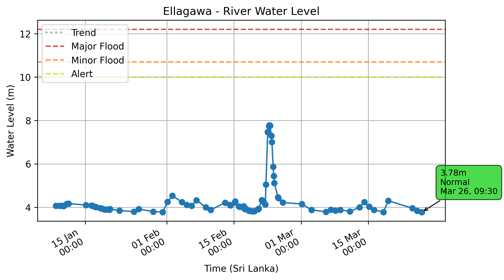

## Maha Oya River Basin (RB 102)

### Maha Oya

#### 🟢 Normal - [Badalgama](https://www.google.com/maps/place/7.2931279607144255,79.97767925329397) Gauging Station

*Last Updated **291 hours** ago* ⌛

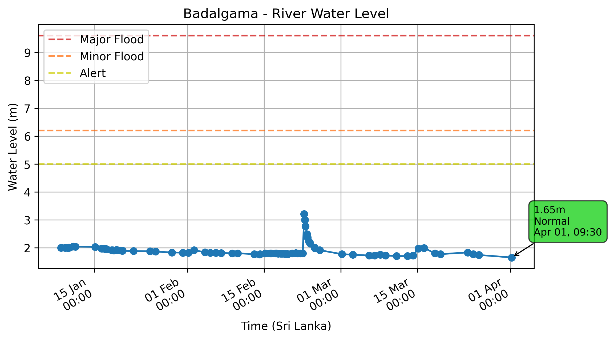

#### 🟢 Normal - [Giriulla](https://www.google.com/maps/place/7.3303094121475345,80.12432086937476) Gauging Station

*Last Updated **291 hours** ago* ⌛

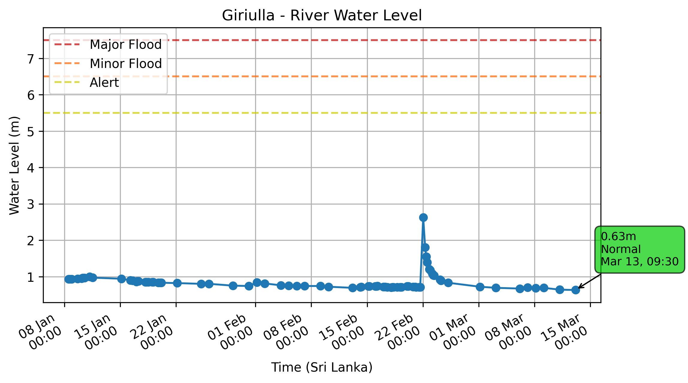

## Kumbukkan Oya River Basin (RB 31)

### Kumbukkan Oya

#### 🟢 Normal - [Nakkala](https://www.google.com/maps/place/6.890291115719028,81.29789316071579) Gauging Station

*Last Updated **291 hours** ago* ⌛

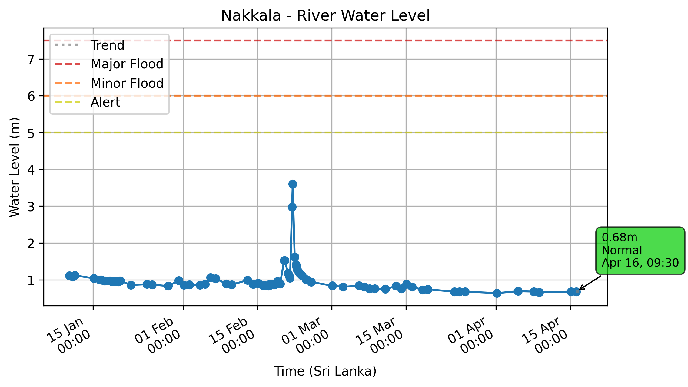

## Kelani Ganga River Basin (RB 01)

### Kehelgamu Oya

#### 🟢 Normal - [Norwood](https://www.google.com/maps/place/6.839557267884663,80.61239609102284) Gauging Station

*Last Updated **291 hours** ago* ⌛

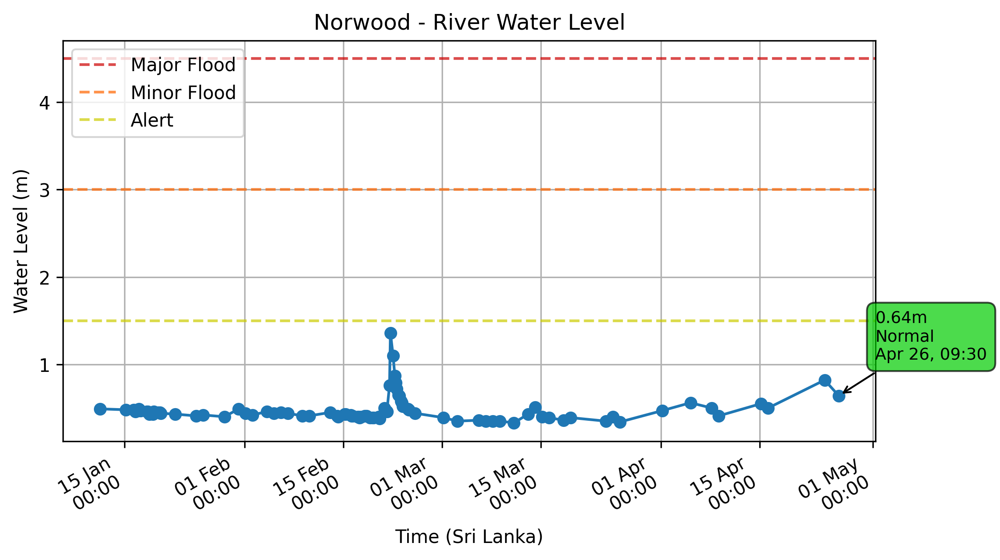

### Gurugoda Oya

#### 🟢 Normal - [Holombuwa](https://www.google.com/maps/place/7.18861230041471,80.27381001159266) Gauging Station

*Last Updated **291 hours** ago* ⌛

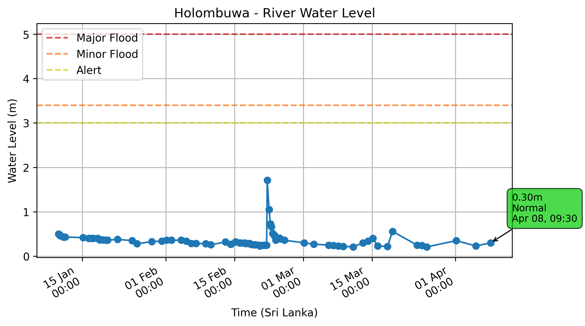

### Kelani Ganga

#### 🟢 Normal - [Kithulgala](https://www.google.com/maps/place/6.985283769517581,80.42544930669654) Gauging Station

*Last Updated **291 hours** ago* ⌛

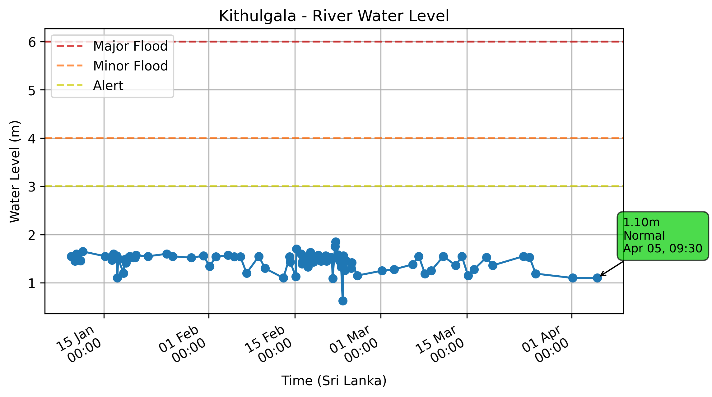

#### 🟢 Normal - [Nagalagam Street](https://www.google.com/maps/place/6.96027242132317,79.87858326530204) Gauging Station

*Last Updated **291 hours** ago* ⌛

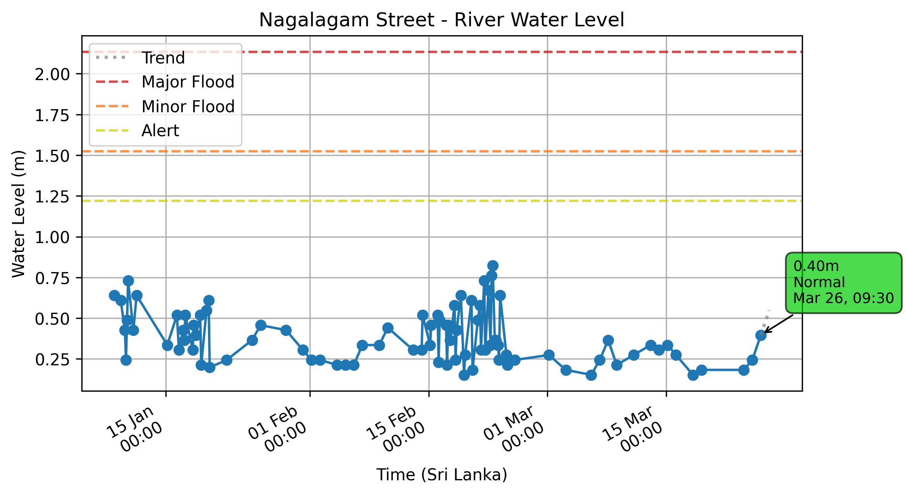

#### 🟢 Normal - [Glencourse](https://www.google.com/maps/place/6.975736673046383,80.18660711562987) Gauging Station

*Last Updated **291 hours** ago* ⌛

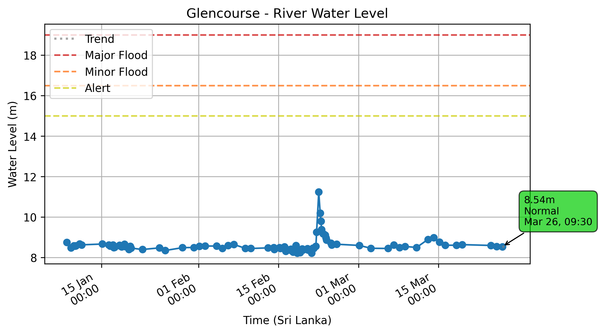

#### 🟢 Normal - [Hanwella](https://www.google.com/maps/place/6.910489028063102,80.08133984391833) Gauging Station

*Last Updated **291 hours** ago* ⌛

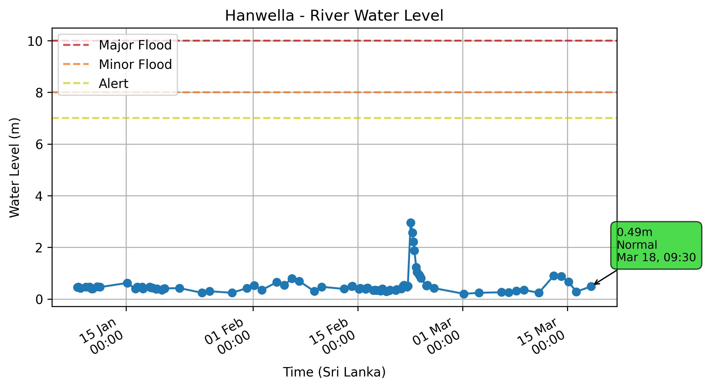

### Seethawaka Ganga

#### 🟢 Normal - [Deraniyagala](https://www.google.com/maps/place/6.925762947059961,80.33922404112188) Gauging Station

*Last Updated **291 hours** ago* ⌛

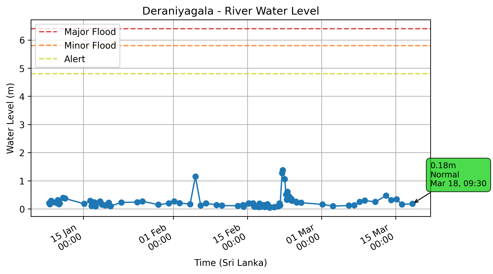

## Deduru Oya River Basin (RB 99)

### Deduru Oya

#### 🟢 Normal - [Moragaswewa](https://www.google.com/maps/place/7.731867586461941,80.24296279159842) Gauging Station

*Last Updated **291 hours** ago* ⌛

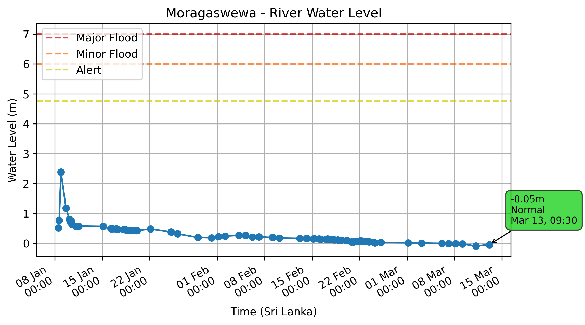

## Heda Oya River Basin (RB 36)

### Heda Oya

#### 🟢 Normal - [Siyambalanduwa](https://www.google.com/maps/place/6.905508688496518,81.54537666124355) Gauging Station

*Last Updated **291 hours** ago* ⌛

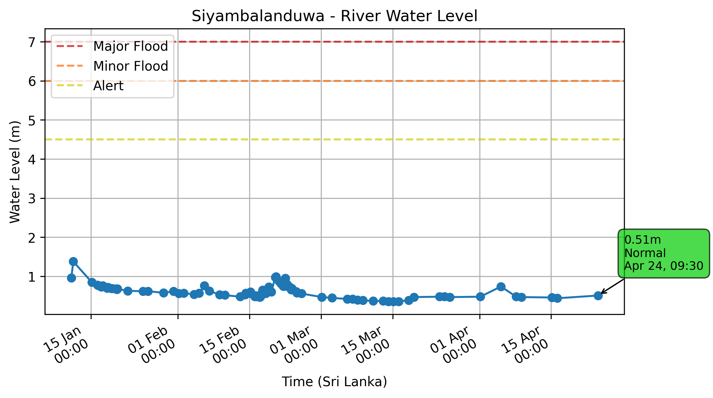

## Kirindi Oya River Basin (RB 22)

### Kirindi Oya

#### 🟢 Normal - [Thanamalwila](https://www.google.com/maps/place/6.44280954004885,81.13889314602751) Gauging Station

*Last Updated **291 hours** ago* ⌛

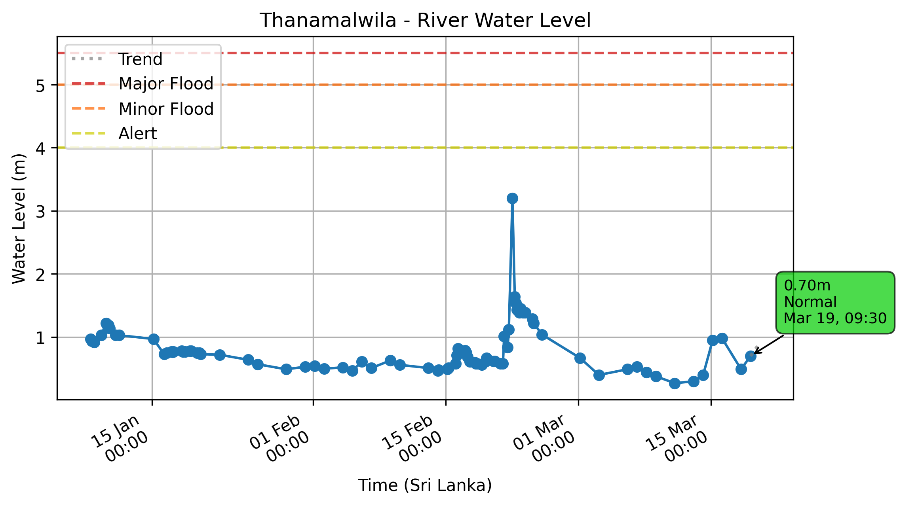

#### 🟢 Normal - [Wellawaya](https://www.google.com/maps/place/6.733186416118142,81.10987205932976) Gauging Station

*Last Updated **291 hours** ago* ⌛

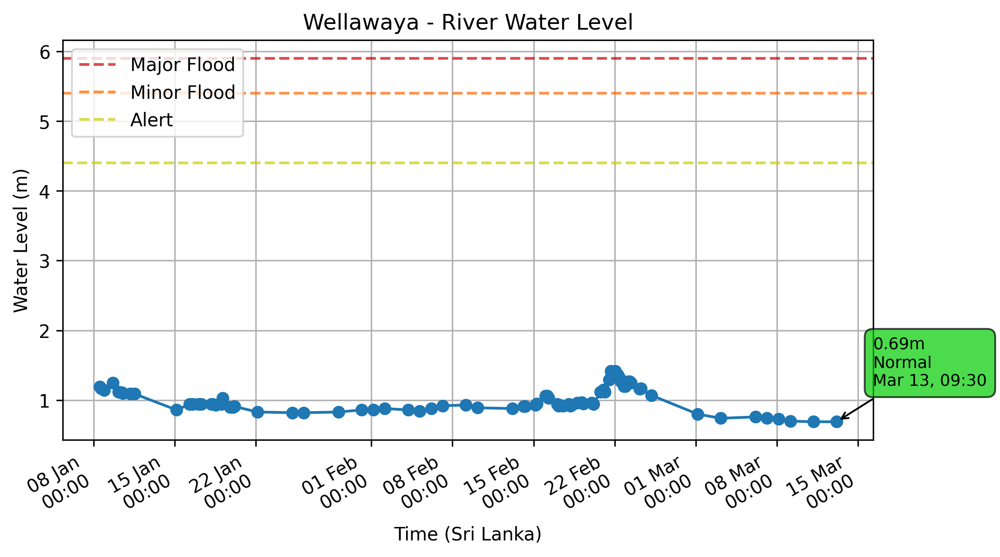

### Kuda Oya

#### 🟢 Normal - [Kuda Oya](https://www.google.com/maps/place/6.531299778512797,81.11931312403397) Gauging Station

*Last Updated **291 hours** ago* ⌛

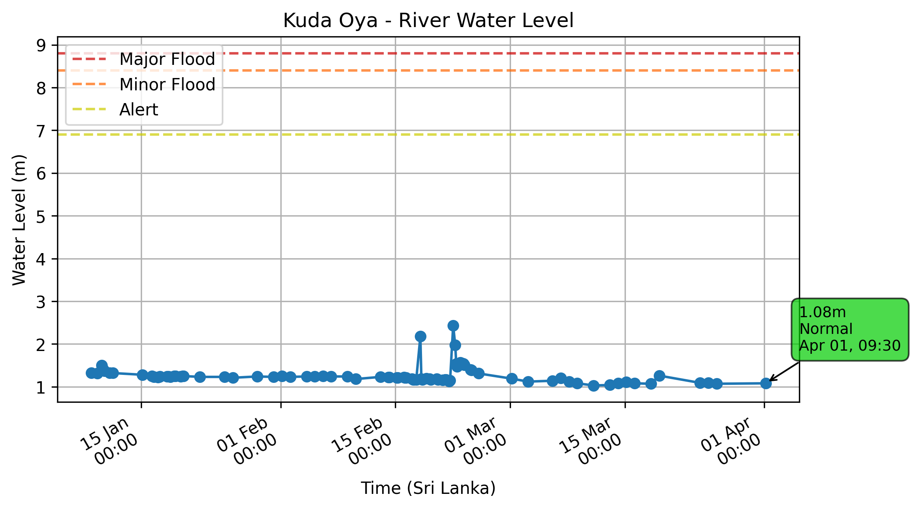
